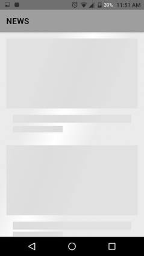

# News app

News app was written with one goal: showcase architecture component in Android in a real application.

## Features

1. Show a launch screen
   + Branded launch
   + Placeholder UI using(Facebook Shimmer)
2. Show a list news
3. Show a detail news

## Technologies

 + Architecture Components
 + Retrofit
 + Kotlin
 + Material Components

## Screenshots

